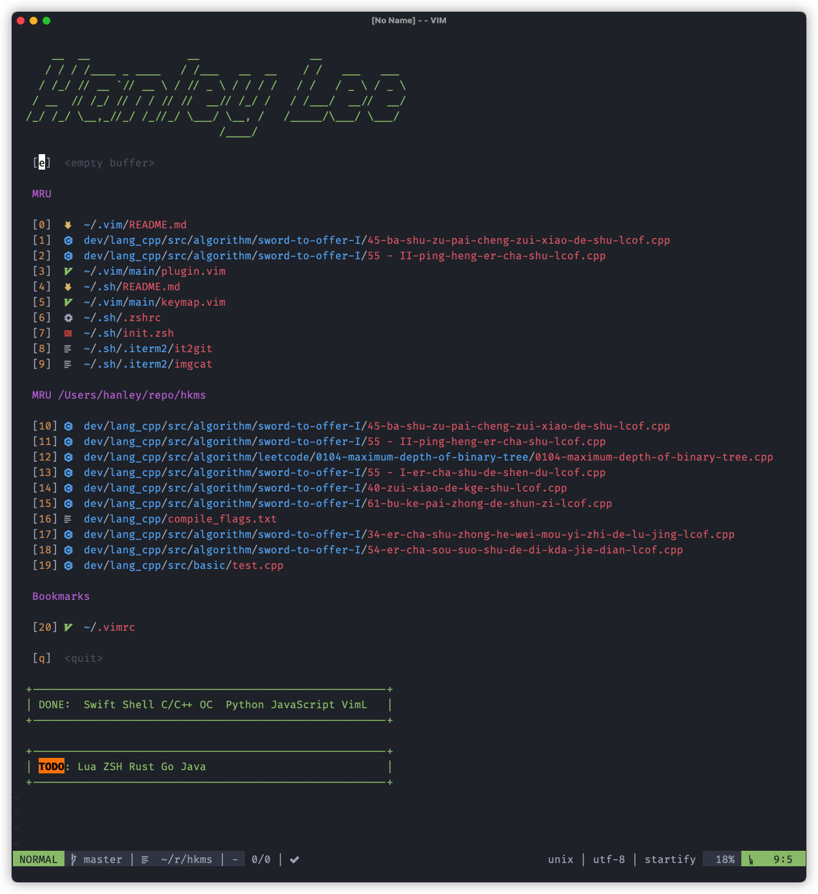

# dotvim

My Vim configuration

## What is this repository for?

You can visit my configuration for **inspiration**!

## How I use it?

I just put `.vimrc` file on `$HOME`, and set contents of `$HOME/.vimrc` as below

```bash
source ~/.vim/vimrc
```

This repository is my `$HOME/.vim/` directory

## Dependency

- [MacVim](https://github.com/macvim-dev/macvim)
- package-manager: [vim-plug](https://github.com/junegunn/vim-plug)
- font: [Yahei-Fira-Icon-Hybrid-Font](https://github.com/hanleylee/yahei-fira-icon-hybrid-font)
- os: MacOS

## Most Used Plugin

- fuzzy finder: [fzf.vim](https://github.com/junegunn/fzf.vim)
- completion: [coc.nvim](https://github.com/neoclide/coc.nvim)
- theme: [onedark.vim](https://github.com/joshdick/onedark.vim)
- statusline: [lightline.vim](https://github.com/itchyny/lightline.vim)
- markdwon syntax: [vim-markdown](https://github.com/plasticboy/vim-markdown)
- file finder: [fern](https://github.com/lambdalisue/fern.vim)
- terminal: [vim-floaterm](https://github.com/voldikss/vim-floaterm)
- project manage: [asynctasks.vim](https://github.com/skywind3000/asynctasks.vim)
- ...

## Preview



more screenshot [here](./PREVIEW.md)...
